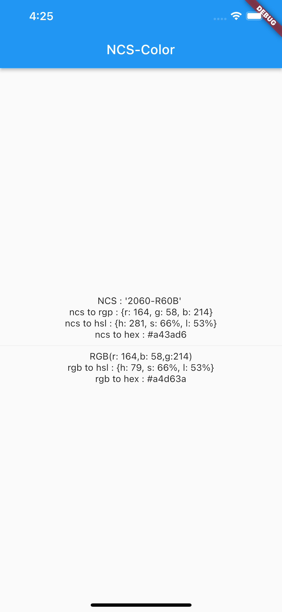

NCSColor
=====
A simple Dart package to convert NCS-color to his RGB, HSL, and HEX value and used to convert RGB to HSL and RGB to HEX.

Installation
-----
1. Add this to your package's `pubspec.yaml` file:

```yaml
dependencies:
  ncscolor: any
```

1. Get the package using your IDE's GUI or via command line with

```bash
$ pub get
```

1. Import the `color.dart` file in your app

```dart
import 'package:ncscolor/ncscolor.dart';
```

Usage
-----
To convert ncs-color to rgb

```dart
NCSColor(ncsCode: '2060-R60B').toRgb(); //return {r:164, g:58, b:214}
```
To convert ncs-color to hsl

```dart
NCSColor(ncsCode: '2060-R60B').toHsl(); //return {h:281, s:66%, l:53%}
```

To convert ncs-color to hex

```dart
NCSColor(ncsCode: '2060-R60B').toHex(); //return #a43ad6
```

To convert rgb to hsl

```dart
ColorConvert.rgbToHsl(r: 164,b: 58,g:214); //return {h:281, s:66%, l:53%}
```
To convert rgb to hex

```dart
ColorConvert.rgbToHex(r: 164,b: 58,g:214); //return #a43ad6
```

## Screenshots


To online test (w3schools)

http://www-db.deis.unibo.it/courses/TW/DOCS/w3schools/colors/colors_converter.asp-color=ncs(4040-R90B).html

W3Color JavaScript Library
The JavaScript library used in the color converter can be downloaded from

http://www.w3schools.com/lib/w3color.js