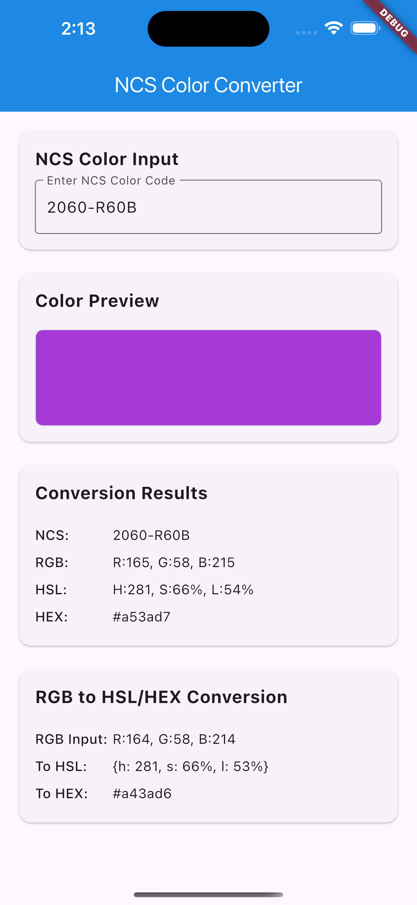

# NCSColor 🎨

[](https://pub.dev/packages/ncscolor)
[](https://opensource.org/licenses/MIT)

A comprehensive Dart package for converting **NCS (Natural Color System)** colors to RGB, HSL, and HEX formats, with additional RGB conversion utilities. Perfect for Flutter apps and Dart projects that need to work with NCS color specifications.

## 🌐 Live Demo

**[🚀 Try the Interactive Web Demo](https://mohamedabd0.github.io/ncscolor/)**

Experience NCSColor in action with our live Flutter web demo! Test color conversions, explore the NCS color system, and see real-time previews of your color transformations.

## ✨ Features

- 🎯 **NCS to RGB conversion** - Convert NCS color codes to RGB values
- 🌈 **NCS to HSL conversion** - Get HSL representation of NCS colors
- 🎨 **NCS to HEX conversion** - Generate hex color codes from NCS
- 🔄 **RGB to HSL conversion** - Convert RGB values to HSL format
- 🔄 **RGB to HEX conversion** - Convert RGB values to hex format
- ✅ **Input validation** - Proper NCS format validation with clear error messages
- 📱 **Flutter ready** - Works seamlessly with Flutter Color widgets
- 🚀 **Modern Dart** - Built with latest Dart features and null safety

## 🚀 Installation

Add this to your package's `pubspec.yaml` file:

```yaml
dependencies:
  ncscolor: ^1.0.0
```

Then run:

```bash
flutter pub get
```

## 📖 Usage

### Import the package

```dart
import 'package:ncscolor/ncscolor.dart';
```

### NCS Color Conversions

```dart
// Create an NCS color instance
final ncsColor = NCSColor(ncsCode: '2060-R60B');

// Convert to RGB
final rgb = ncsColor.toRgb();
print(rgb); // {r: 164, g: 58, b: 214}

// Convert to HSL
final hsl = ncsColor.toHsl();
print(hsl); // {h: 281, s: 66%, l: 53%}

// Convert to HEX
final hex = ncsColor.toHex();
print(hex); // #a43ad6
```

### RGB Conversions

```dart
// RGB to HSL
final hsl = ColorConvert.rgbToHsl(r: 164, g: 58, b: 214);
print(hsl); // {h: 281, s: 66%, l: 53%}

// RGB to HEX
final hex = ColorConvert.rgbToHex(r: 164, g: 58, b: 214);
print(hex); // #a43ad6
```

### Using with Flutter Colors

```dart
final ncsColor = NCSColor(ncsCode: '2060-R60B');
final rgb = ncsColor.toRgb();

// Create a Flutter Color
final flutterColor = Color.fromRGBO(
  rgb['r']!,
  rgb['g']!,
  rgb['b']!,
  1.0,
);

// Use in your widgets
Container(
  color: flutterColor,
  child: Text('Hello NCS!'),
)
```

## 🎨 NCS Color Format

The Natural Color System (NCS) uses a specific format for color codes:

- **Format**: `####-[RGBY][##[RGBY]]`
- **Examples**:
  - `2060-R60B` (Red-Blue with 20% blackness, 60% chromaticness, 60% blue)
  - `1050-Y90R` (Yellow-Red with 10% blackness, 50% chromaticness, 90% red)
  - `0505-B` (Blue with 5% blackness, 5% chromaticness)

### Format breakdown:

- First two digits: **Blackness** (00-99)
- Next two digits: **Chromaticness** (00-99)
- Letter: **Hue** (R=Red, G=Green, B=Blue, Y=Yellow)
- Optional: **Hue percentage** and **secondary hue**

## 📱 Example App

Check out the `/example` folder for a complete Flutter app demonstrating all features:

- Interactive NCS color input
- Real-time color preview
- All conversion formats displayed
- Error handling and validation



## 🔧 API Reference

### NCSColor Class

#### Constructor

```dart
NCSColor({required String ncsCode})
```

#### Methods

- `Map<String, int> toRgb()` - Returns RGB values
- `Map<String, String> toHsl()` - Returns HSL values
- `String toHex()` - Returns hex color code
- `String toString()` - String representation
- `bool operator ==(Object other)` - Equality comparison
- `int get hashCode` - Hash code

### ColorConvert Class

#### Static Methods

- `Map<String, String> rgbToHsl({required int r, required int g, required int b})`
- `String rgbToHex({required int r, required int g, required int b})`

## ⚠️ Error Handling

The package provides clear error messages for invalid NCS codes:

```dart
try {
  final ncsColor = NCSColor(ncsCode: 'invalid-code');
  final rgb = ncsColor.toRgb();
} catch (e) {
  print(e); // ArgumentError: Invalid NCS color format...
}
```

## 🧪 Testing

Run the test suite:

```bash
flutter test
```

## 🤝 Contributing

Contributions are welcome! Please feel free to submit a Pull Request. For major changes, please open an issue first to discuss what you would like to change.

1. Fork the repository
2. Create your feature branch (`git checkout -b feature/amazing-feature`)
3. Commit your changes (`git commit -m 'Add some amazing feature'`)
4. Push to the branch (`git push origin feature/amazing-feature`)
5. Open a Pull Request

## 📚 Resources

- [NCS Color System Documentation](https://ncscolour.com/)
- [Natural Color System on Wikipedia](https://en.wikipedia.org/wiki/Natural_Color_System)
- [Flutter Color Class](https://api.flutter.dev/flutter/dart-ui/Color-class.html)

## 📄 License

This project is licensed under the MIT License - see the [LICENSE](LICENSE) file for details.

## 🙏 Acknowledgments

- Based on the Natural Color System specification
- Inspired by W3Schools color converter algorithms
- Built with ❤️ for the Flutter community

---

**Made with Flutter 💙**
